# GUI for Biological Imaging: Lightsheet Microscopy and More

[ Under Construction - Please exercise caution as our team continues to refine the codebase, as there may be existing bugs yet to be addressed.]

## Introduction
Image segmentation is utilized in many areas of biological research for identifying specific image regions, extracting features, and quantifying signals in microscopy images. Furthermore, automated segmentation approaches can be utilized to reduce the size of data sets by cropping out the regions of interest (ROIs) for subsequent image processing and are especially relevant when handling large datasets, as is common in many light sheet modalities. Here we describe a modular graphical user interface (GUI) developed in MATLAB which enables the user to navigate and visualize multidimensional data, apply various preprocessing options, and perform segmentation with only 3 adjustable parameters. Preprocessed data is segmented using traditional parametric methods, which can be further refined by post processing options, including active contours and manual adjustments. Resulting datasets from the segmentation can be used to train a deep neural network to perform semantic segmentation on regions for various needs. Furthermore, image segmentation facilitates the detection of centroids for a variety of ROIs such as those that would describe the location of nuclei in a biological sample to track development.

To get additional information about this project and our work, please refer to this [MathWorks News and Stories article](https://www.mathworks.com/company/mathworks-stories/image-processing-and-ai-based-lightsheet-microscopy-tool-provide-data-insight.html).

Work from this project was presented in a [poster](https://www.focusonmicroscopy.org/2024-program-online/?source=pp&event_id=5817&tab=pdf&a_id=7311) at [Focus on Microscopy (FOM) 2024](https://www.focusonmicroscopy.org/) in Genova, Liguria, Italy as well as the [New England Society for Microscopy (NESM) Spring Symposium](https://nesmicroscopy.wildapricot.org/event-5574777) in Woods Hole, MA, USA.

## GUI Overview
A screenshot of the GUI upon launch shows a cutaway view of the software’s computed boundary for a segmented *Parhyale hawaiensis* embryo with a DAPI stain imaged on a lightsheet system (sample courtesy of Dr. Carsten Wolff, Marine Biological Laboratory).

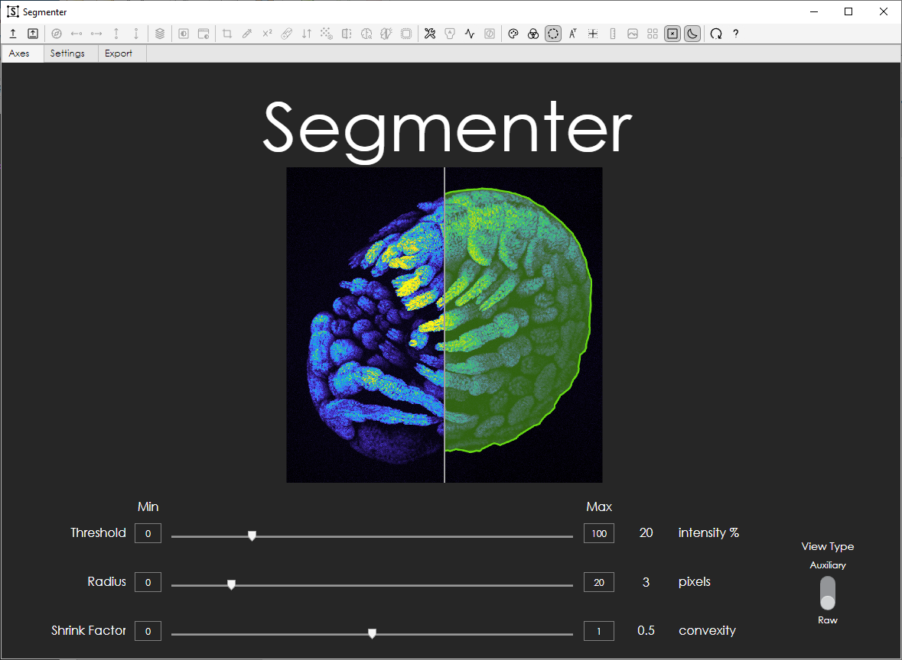

### GUI Result Types
Here we show three different algorithms used within the GUI on the same *Caenorhabditis elegans* embryo with a Histone marker imaged on a diSPIM system.
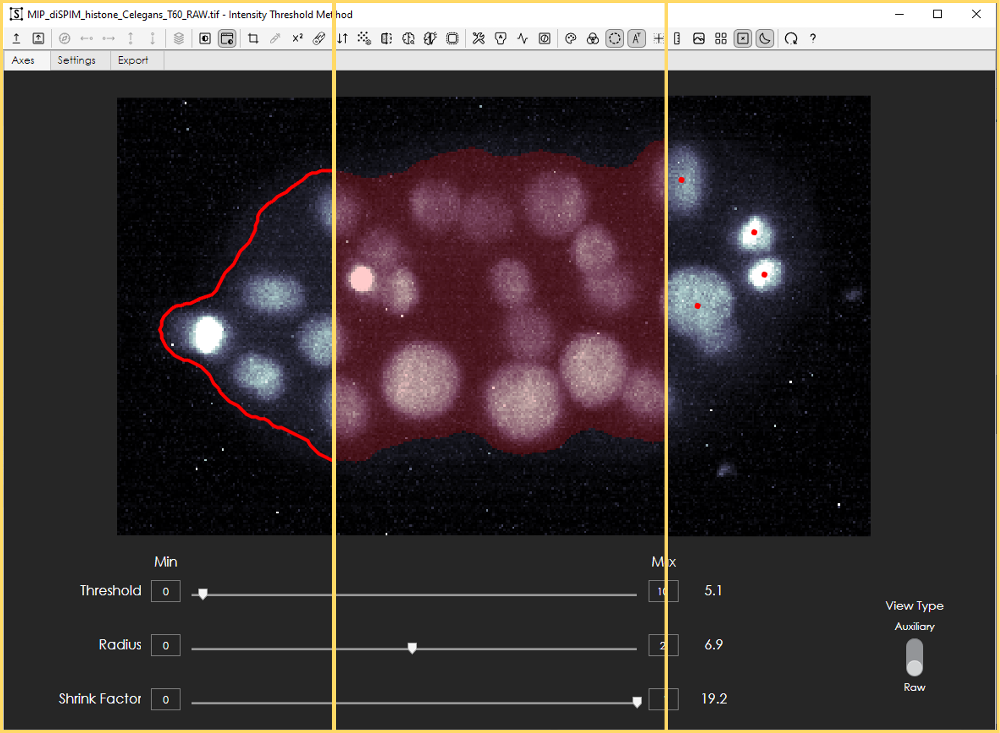

From left to right, we show the GUIs capability to overlay three different result formats:
1.	**Contour**: a closed curve that represents the boundary of an ROI
2.	**Masks**: a binary image with a value of 1 inside the ROI and 0 elsewhere
3.	**Point cloud**: a set of points representing detections or centroids of segmented ROIs

### GUI Settings
The settings tab has settings for active contours, visualization, and adjusting where the user would like to stop in the processing pipeline. Mask opacity will apply to pipelines that result in **masks**. The point marker and marker width properties apply to **point clouds**. Lastly, the line width property applies to **contour** outputs.

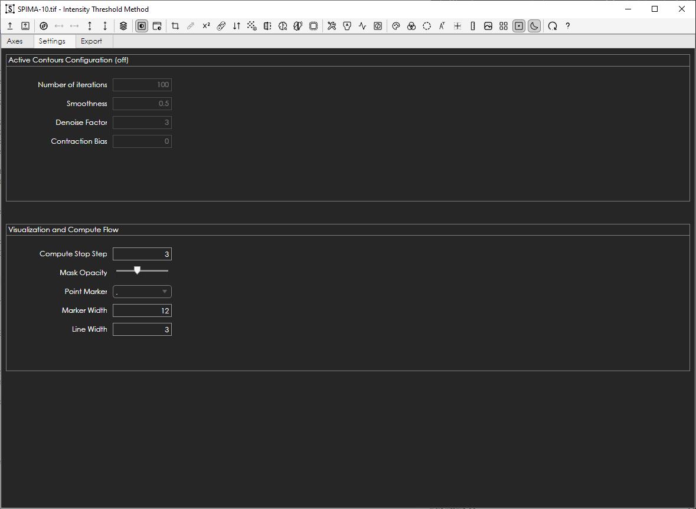

### GUI Results Export
The export tab allows the user to set their save location as well as how they would like to export the computed results. The settings used in the GUI to produce the results are always tracked and saved, even if images were processed in a sparse manner by skipping time or slice indices: there is no need to view and process the image planes sequentially. If the user has produced masks or contours, properties of the ROI(s) can be computed and saved as well by selecting options in the Masking Properties list. By default, masks/contours are not saved as image files, but if the user toggles mask saving, masks can be saved in `.tif` image volumes or as individual 2D planes in `.png` files.

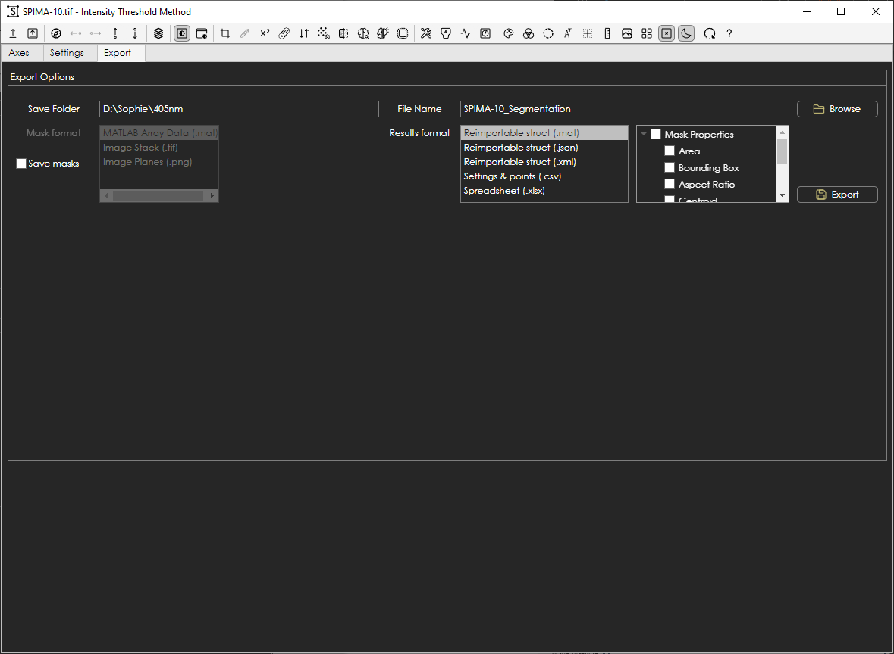

### Software Architecture
The underlying architecture and modular framework that we have developed to expedite development of image processing and analysis GUIs is shown below.

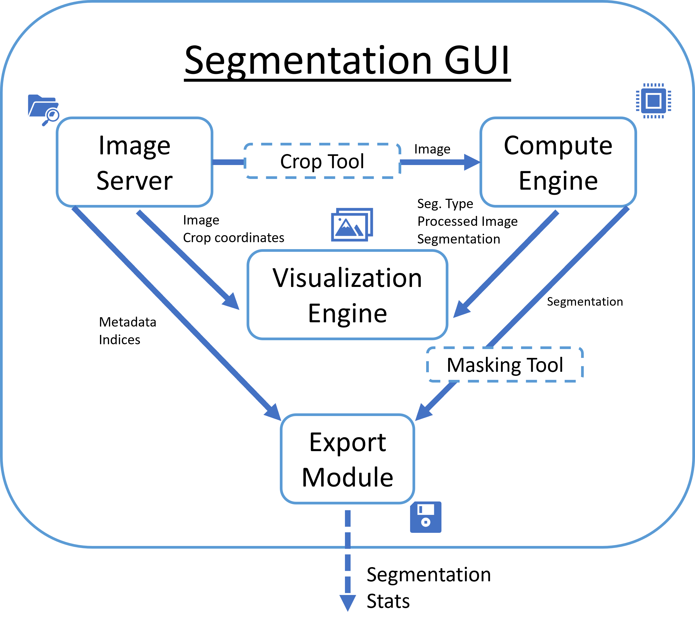

## User Workflow
The `ImageServer` manages loading of **raw image** 2D planes from image volumes and timeseries across a variety of formats. Lazy loading is on by default but can be toggled off to enable loading of entire 3D volumes at a given timepoint. This data is then passed off to the compute engine, `SegmentationEngine`, which will perform the selected preprocessing options to produce an **auxiliary image**. A list of available options which can be toggled in the GUI is shown below.
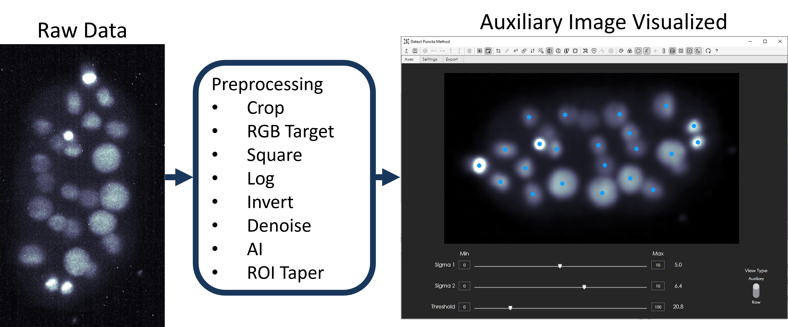

The **auxiliary image** is then passed through the parametric algorithm in the engine to produce a result in one of the three acceptable [formats](#gui-result-types). The **raw image** or **auxiliary image** can be viewed with a user-selected colormap in the GUI’s main window with the computed results in a user-selected color overlaid atop. Although there are three sliders that correspond to three parameters, some algorithms may have more than three functions or steps in the parametric pipeline. One such case is shown below in the Pipeline Visualization Tool.

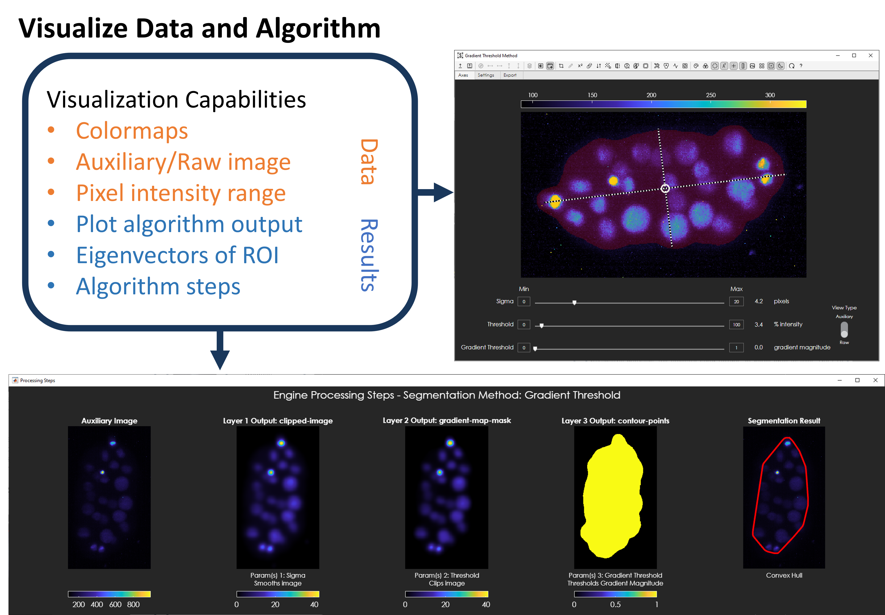

Settings used to produce the results are stored in the GUI in a data structure that also keeps track of computed results. This information can then be exported.

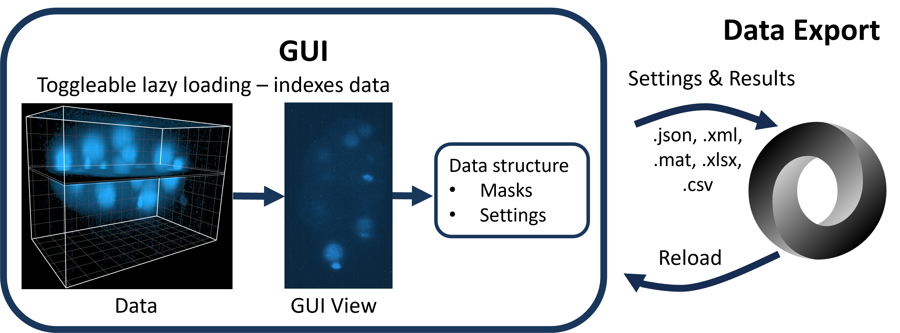

### Tools
In addition to the main GUI’s visualization and parametric processing capabilities, there are several embedded tools with their own GUIs that facilitate preprocessing, optimization of parameter selection, and post-processing. Preprocessing tools include the Crop Tool, ROI Taper Tool, and the Color Target Transform Tool. The active contours settings allow for semi-automated refinement of mask and contour outputs while the Editing Tool enables users to perform manual adjustments to results.

#### Crop Tool
The crop tool will set a bounding box to grab planes from the original data after the user has drawn an ROI. This reduces the amount of data that is loaded in and computed on, thus expediting computation while still saving results with respect to the original image coordinates.

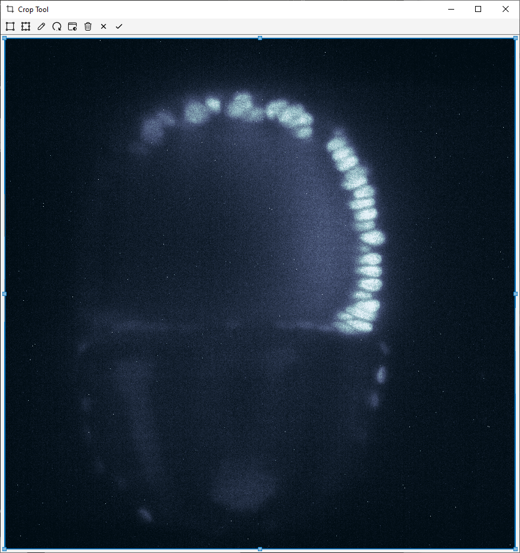

####  ROI Taper Tool
The ROI Taper Tool allows users to define ROIs that they would like to emphasize more than other regions. This tool will then taper in a Tukey window fashion out from the ROI boundary to the image boundary such that the pixels inside and at the edge of the ROI boundary keeps their original value and pixels at the image boundary have a value of 1.
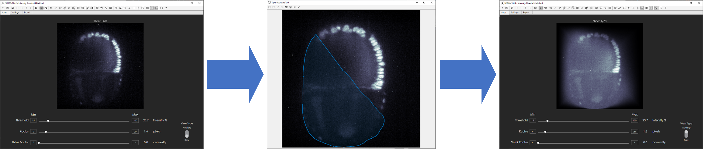

#### Color Target Transform Tool
The Color Target Transform Tool is to be used for color image only. This tool allows the user to select a pixel within the image to set a target color. The image is then transformed such that pixels with a color (RGB values) equal to the target have a value of 1 and those that are furthest away from the color (orthogonal in RGB space) have a value of 0.

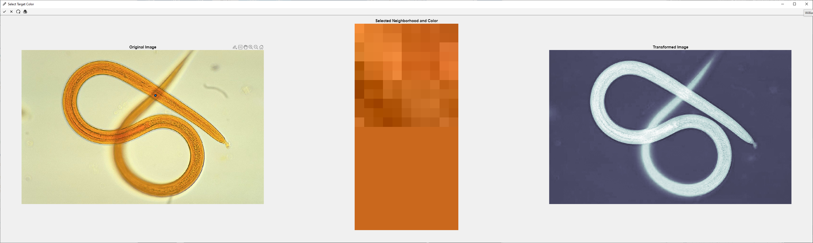

#### Pipeline Visualization Tool

The Pipeline Visualization Tool enables users to see processing steps that takes place in the parametric algorithm pipeline. The user can decide to stop at any given step that produces one of the three acceptable [output types](#gui-result-types). Visualization of each processing step enables optimal processing and analysis for specific use cases across light sheet microscopy and other modalities.

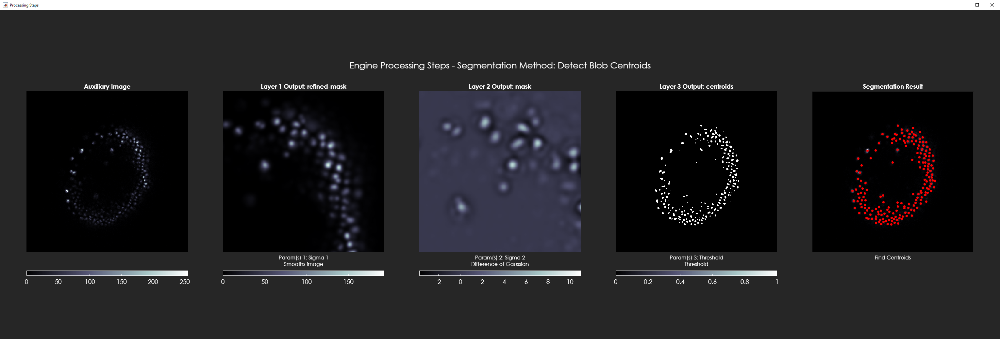

#### Active Contours
The Settings tab of the GUI allows for configuration of the active contours post processing of results. Adjusting these settings requires the user to toggle Active contours on. This is an iterative refinement that can be

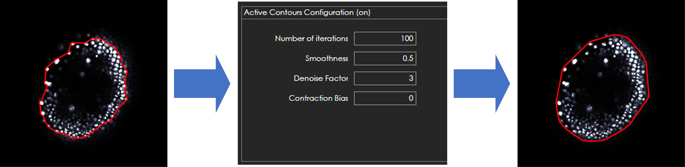

#### Editing Tool
The Editing tool can be used to edit any of the Segmentation GUI's result types. We show below how a contour detection on a *P. hawaiensis* embryo can be manually refined in the Editing Tool via the turbo paint brush method. This modality of adjustment is feasible for either **mask** or **contour** results.

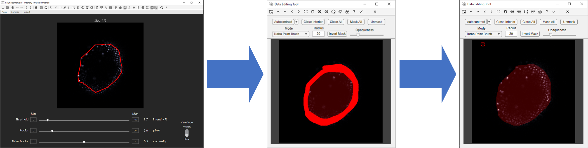

Alternatively, if the user would like to perform blob detections such as detections of nuclei, those **point cloud** results can also be refined. The Editing Tool will place 'x' markers in points that are removed from the original set of detections and place '+' markers where the user has manually placed new detections.

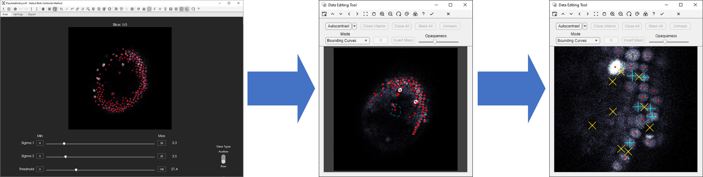

### Applications
Here, we primarily focus on lightsheet microscopy data from a diSPIM system and show applications of our software to this imaging modality. We prepared a training dataset by manually segmenting a specific ROI from a subset of data to train a model to segment the ROI across a 4D volumetric timeseries of a butterfly ovary. We trained a deep network, DeepLabV3+ with a Resnet18 backbone, on ~3% of the data spread across time and space, enabling the network to infer across space and time. This network was then used to segment the ROI with excessive SiR-actin signal that would otherwise obfuscate important features in a maximum intensity projection.

## Getting Started
Download the `Software` folder in this repository if you have MATLAB. Alternatively, one can download the `CompiledSoftware` folder after installing the [MATLAB runtime]( https://www.mathworks.com/products/compiler/matlab-runtime.html). This enables user without a MATLAB license to run our software.

1.`Software` Folder Use case:
* Run the `ROISegmentationGUI.mlapp`.

2.`CompiledSoftware` Folder Use case:
* Run the `ROISegmentationGUI.p`.
